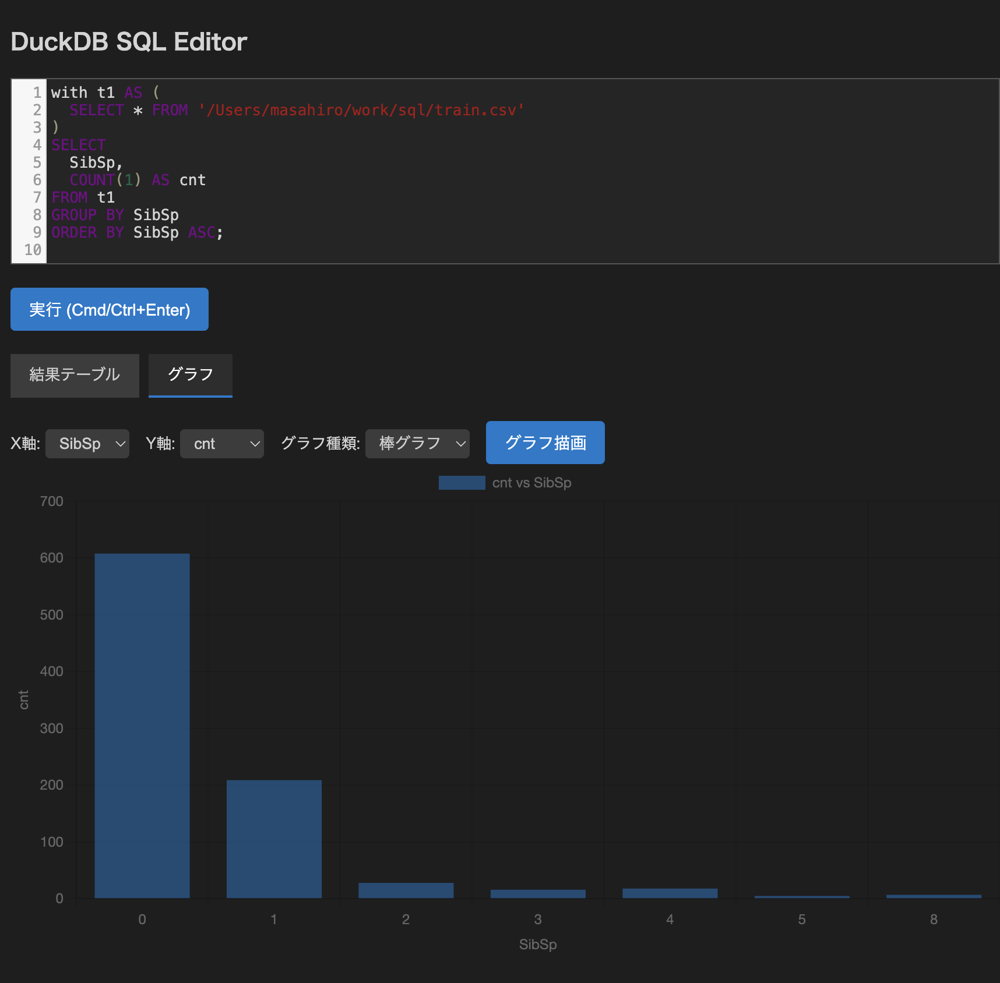

# duckcode

## これは何？

- duckdbをvscode経由で書けるようにしたvscodeの拡張機能です。
- 特に開発中に集めたCSVやjsonlなどをサクッと分析しつつ、SQLファイルをコード管理して扱うことを目的にしています。

## 使い方

- [こちら](https://github.com/marufeuille/duckcode/releases)から最新のvsixをダウンロードしてください
- [こちら]の記載に従ってインストールしてください
